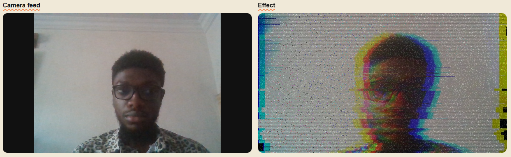
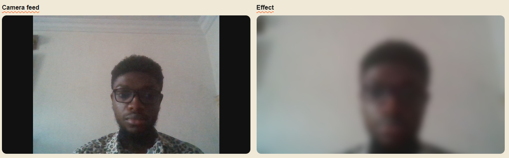
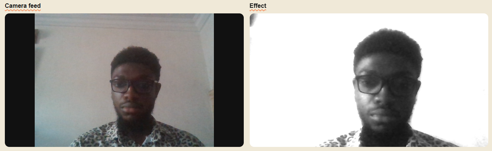
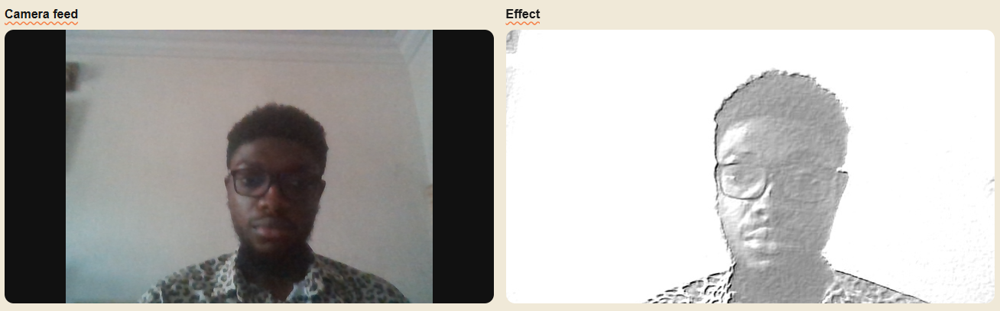
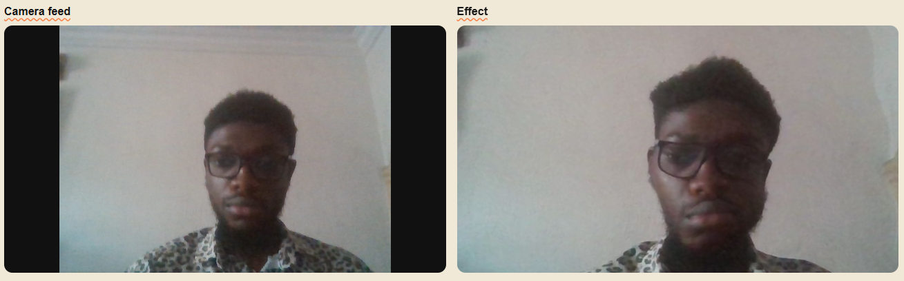
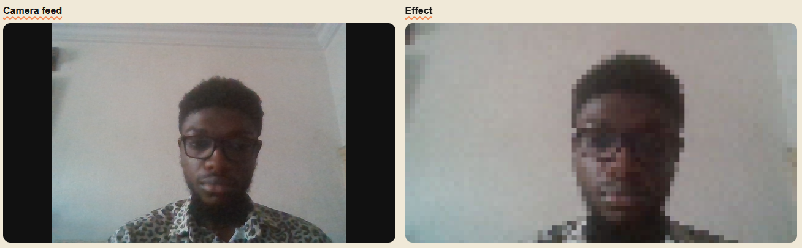

# GoCV — Real-Time Webcam Effects

A full-stack application that captures live webcam frames in the browser, ships them over HTTP to a Go backend, applies computer vision effects using OpenCV, and streams the processed image back for display — all in near real-time.

---

## What It Does

The user opens the web app, grants camera access, selects an effect, and hits **Begin Effects**. Every 20 seconds a snapshot is taken from the live camera feed, sent as a JPEG to the Go server, processed with OpenCV via GoCV (a Go wrapper for the OpenCV library), and the result is displayed alongside the live feed.

---

## Architecture

```
┌──────────────────────────────────────────────────────────┐
│                    Browser (Next.js)                     │
│                                                          │
│  browser camera feed     feed processor                  │
│  ─────────────────────   ──────────────────────────────  │
│  MediaStream → <video>   Canvas capture → JPEG Blob      │
│                          POST JPEG Blob  every 20 s      │
│                          <Image> ← objectURL from resp   │
└────────────────────────────┬─────────────────────────────┘
                             │  
                             │  ← HTTP POST (JPEG body)
                             ▼
┌──────────────────────────────────────────────────────────┐
│                  Go HTTP Server (:4000)                  │
│                                                          │
│  httprouter → middleware → handler → apply effect        │
│  → send response                                         │
│  middleware: CORS, panic recovery                        │
│                                                          │
│  gocv.IMDecode → [transform] → gocv.IMEncode             │
│                                                          │
└──────────────────────────────────────────────────────────┘
```

### Frontend — `gocv-proj/` (Next.js 16 / React 19)

| Layer | Detail |
|---|---|
| **Framework** | Next.js 16 with the App Router and TypeScript |
| **Styling** | Tailwind CSS v4 |
| **Animation** | Framer Motion |
| **Camera hook** `useCamera` | Wraps the browser `MediaDevices.getUserMedia` API. Manages stream lifecycle (start / stop), exposes a `videoRef` for the `<video>` element, and tracks status (`idle → starting → running → error`). |
| **Frame hook** `useFrameProcessor` | On a 1-second tick, decrements a countdown. At zero (every 20 s) it draws the current video frame onto an off-screen `<canvas>`, serialises it to a JPEG `Blob`, and sends it in a`POST` body to the backend endpoint. The backend applies the effects and sends a JPEG response to the client which is turned into an `objectURL` and rendered with `<Image>`. |

> **Why 20-second intervals?**  On an average personal PC, it would be computationally expensive to apply effects in real-time (the OpenCV/GoCV image processing algorithms are computationally demanding), infact, an earlier prototype of the project used WebRTC for real-time communication between the frontend and backend, however, the compute requirements could not reasonably be met with the available hardware. With specialised hardware however, implementing, real-time effects is not difficult with the underlying arhitecture.

### Backend — `server/` (Go)

| Layer | Detail |
|---|---|
| **Language** | Go 1.25 |
| **Image I/O** | `gocv.IMDecode` / `gocv.IMEncode` — decode raw JPEG bytes into an OpenCV `Mat`, apply transform, encode back to JPEG. A manual `copy()` after `buf.GetBytes()` prevents a segfault when the native buffer is freed. |
| **Effects package** | Pure functions in `effects/` — each takes `[]byte` and returns `[]byte`, keeping them fully independent of the HTTP layer. |

---

## Technologies

### GoCV / OpenCV (`gocv.io/x/gocv`)

GoCV is the official Go binding for **OpenCV 4**, implemented via cgo. It gives Go access to OpenCV's full C++ API without leaving the Go ecosystem. Key primitives used in this project:

- `gocv.IMDecode` / `gocv.IMEncode` — in-memory JPEG codec, no temporary disk files
- `gocv.Mat` — the fundamental n-dimensional array type that wraps native OpenCV memory; since the Go runtime does not manage memory used outside of Go, every `Mat` must be explicitly `Close()`d to free the underlying C++ allocation, failure to do so would lead to memory leaks as dead memory will not be reclaimed.
- `gocv.Split` / `gocv.Merge` — decompose and recompose BGR channel planes
- `gocv.WarpAffine` — apply an affine transform (translation/rotation/scale) to a whole image or channel
- `gocv.Remap` — per-pixel coordinate remapping using pre-computed map matrices
- `gocv.GaussianBlur` — convolution with a Gaussian kernel for smooth blurring and noise reduction
- `gocv.BilateralFilter` — edge-preserving smoothing used in the cartoon effect
- `gocv.Filter2D` — arbitrary kernel convolution (used for emboss)
- `gocv.AdaptiveThreshold` — locally-adaptive binarisation for edge extraction
- `gocv.CvtColor` — colorspace conversion (BGR ↔ Grayscale)
- `gocv.BitwiseNot`, `gocv.BitwiseAnd` — bitwise operations on Mat data
- `gocv.Resize` — scale images up or down with configurable interpolation

### Other Go libraries

| Library | Purpose |
|---|---|
| `github.com/julienschmidt/httprouter` | HTTP routing |
| `github.com/qeesung/image2ascii` | Convert a decoded `image.Image` to coloured ANSI/ASCII art |

---

## Available Effects

### Glitch



Simulates a digital corruption artefact.

1. **Chromatic aberration** — the BGR (Blue, Green, Red) channels are split and each is shifted horizontally (or diagonally) by a random amount using `WarpAffine`. Red shifts right, blue shifts left, green shifts slightly in both axes. Shifting the channels and thereafter merging the mis-aligned channels produces the characteristic image corruption effect.
2. **Displacement bands** — random horizontal strips of the image are also shifted left or right by up to ±25 pixels using `WarpAffine`. This replicates the torn-scanline artefact seen on corrupted video signals.

### Blur



Applies a **Gaussian blur** effect to the image (`gocv.GaussianBlur`). The effect is configured to produce a strong, photographic depth-of-field–style softening across the whole frame.

### Pencil Sketch



Reproduces the **colour-dodge pencil sketch** algorithm:

1. Convert the image to greyscale.
2. Invert the greyscale image (`BitwiseNot`).
3. Apply other image processing effects
4. Convert the single-channel result back to BGR for JPEG encoding.

### Emboss



1. Convert to greyscale.
2. Apply an emboss kernel with `Filter2D`.

### Wave Ripple



1. Build two same-size `CV32F` map matrices (`mapX`, `mapY`).
2. For every pixel `(x, y)` compute a sinusoidal source coordinate
3. `gocv.Remap` looks up each destination pixel's colour from the computed source position using bilinear interpolation. Border pixels are reflected (`BorderReflect`), avoiding hard black edges.

### Pixelate



A two-step resize trick:

1. **Downscale** the image by `1/blockSize` (default `blockSize = 8`) using linear interpolation. Each destination pixel averages an 8×8 block of source pixels.
2. **Upscale** back to the original dimensions using **nearest-neighbour** interpolation. Because nearest-neighbour copies the same pixel value for an entire block, the result is visually chunky pixel art.

---

## Running Locally

### Backend

Requires OpenCV 4 and GoCV installed (see the [GoCV install guide](https://github.com/hybridgroup/gocv#installation)).

```bash
cd server
go run .
# Server starts on :4000
```

### Frontend

```bash
cd gocv-proj
npm install
npm run dev
# Opens on http://localhost:3000
```

Navigate to `http://localhost:3000/live-effects`, allow camera access, and select an effect.

---

## Future Direction

- **More visual effects** — more effects to implement possibly include thermal heatmap, ASCII art (this has been suprisingly tricky to get right), night-vision green tint and so on.
- **AI-powered captions** — send the snapshot to a vision-language model (e.g. a quantised Qwen2-VL running on the server) and overlay a generated caption on the returned image.
- **Client-side face detection with OpenCV.js** — run a lightweight face detection model directly in the browser (WebAssembly build of OpenCV) to add bounding boxes or apply face-aware effects before sending to the server.
- **Streaming / lower latency** — replace the 20 s polling loop with a WebRTC data channel or WebSocket for continuous frame delivery as compute budget allows.
